# Top Developer Resources. Milestone Project 3

The main purpose of this site is to provide a compilation of high quality learning materials to improve Developers' tech skills. 
It is a website where community can share useful materials they used to develop their skills. All users can search through dataset provided by community members. 
Registered users can create, edit or delete their own dataset. Upon registering, users can add assets to the website.  
Only the admin has permission to delete assets. The goal of this is preventing malicious users from undoing the hard work of other users. 
All users can read other users reviews  The user can read other users reviews and create, update and delete their own reviews. 
User have a profile page where info about their username, bio and an icon are displayed.  
My biggest hope is that Smart Investments will give valuable information to every person interested in digital investments.
This is an educational project only.

## User Stories

General User Goals

- Users expect the site to have a clear purpose so that they can understand what it is intended for upon entering.

- Users want to easily navigate the site and find the desired content quickly and easily.

- Users expect the site to be responsive across all devices.

- Users want to have the option to contact the site owner to have their questions/requests answered.

Sign in/Signup Module.

- Register easily and being able to login immediately after registration.

- View/Edit personal details on their profile after having logged in. 

User Action Module

- Discover New High Quality Learning Resources 

- Being able to do searches based on user criteria to find suited resources.

- User’s ability to review learning resources from the site with info about each of them

Crud Operation Module

- Users should be able to add new resources to the to the site. 

- Users should be able to edit their added learning resources in the site. 

- Users should be able to Delete them. 

- Users should be get a confirmation message on every action (Triggering email on action performed).

## Design

### Colour Scheme

### Typography

The Lato font is the main font of the website with Arial and sans-seriff as fallback. I opted for Lato because it's a sans-seriff that looks stylish and is easy to read.

### Imagery

## Wireframes

### Home Page
   
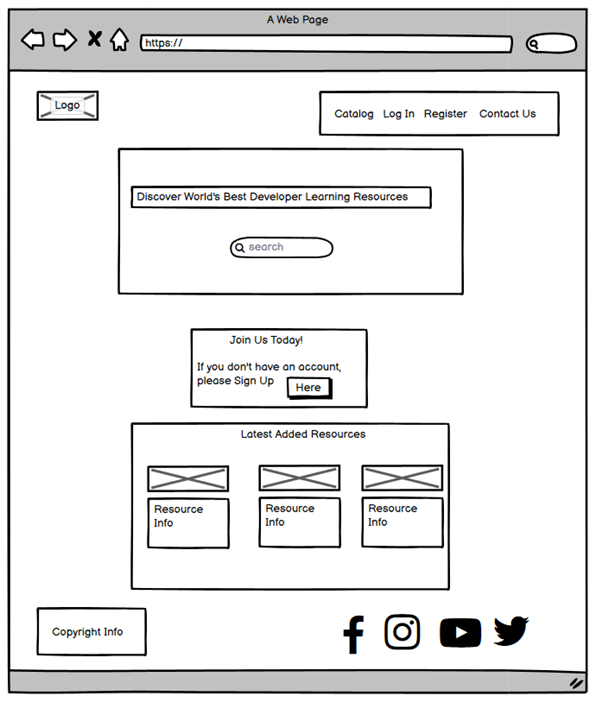

### Home Page Mobile Layout

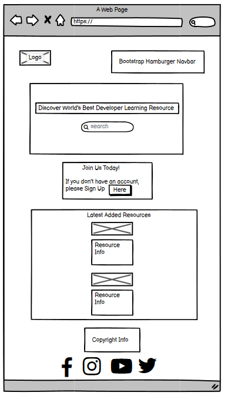

### Resources

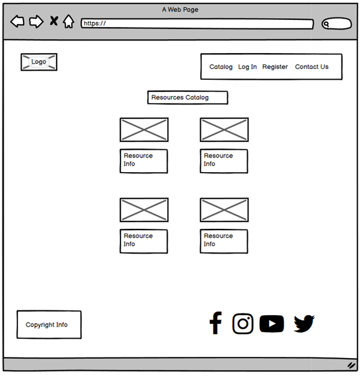

### Resources Mobile Layout

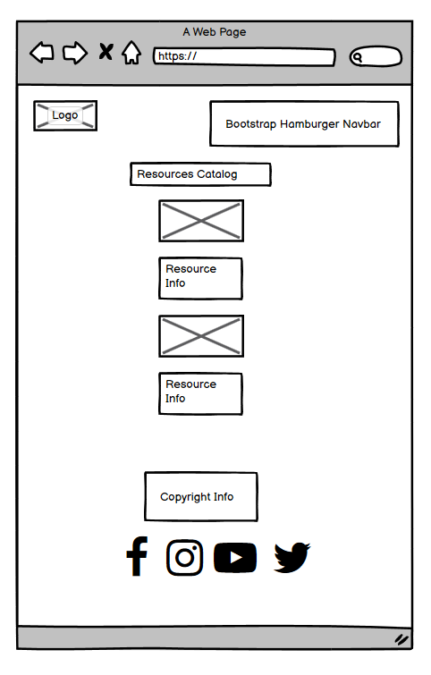

### Ad Resource Page
   
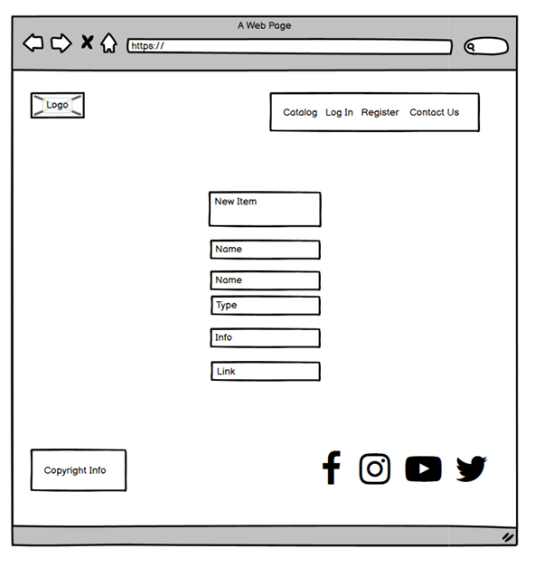

### Ad Resource Page Mobile
   

### Log In Layout

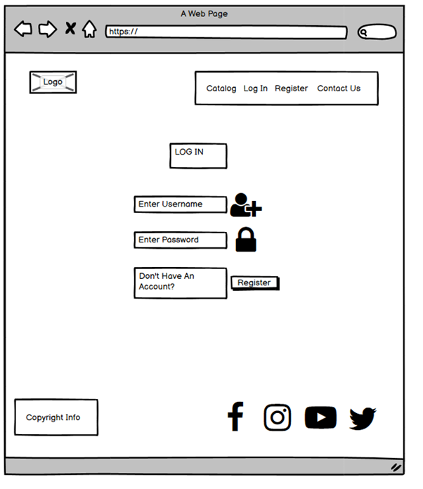

### Log In Mobile Layout

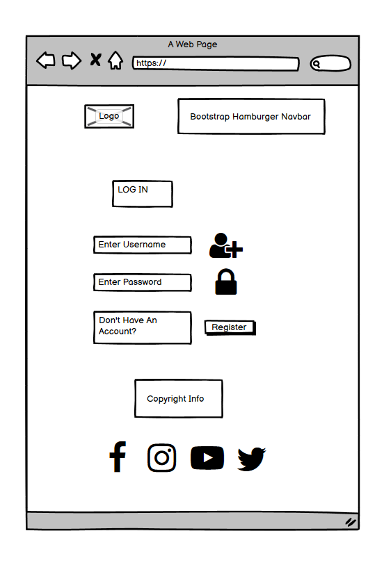
   
### Sign Up Page
   
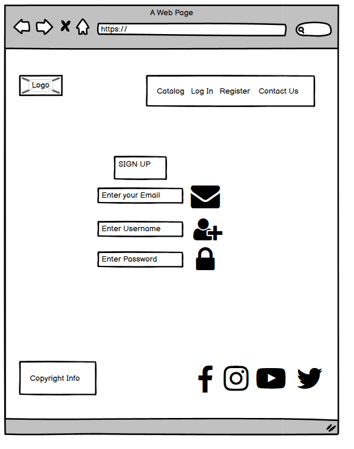
   
### Sign Up Page Mobile
   
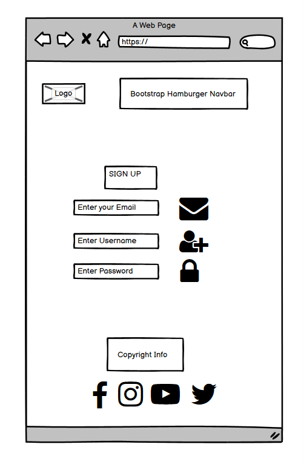
   
### Log In Page
   

### Log In Mobile Layout

### Profile Page
   
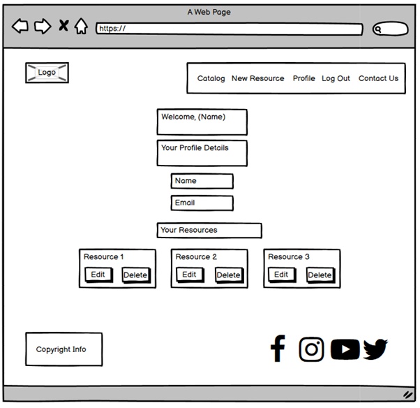

### Profile Mobile Layout

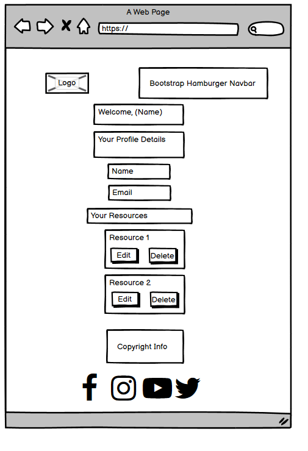

### Log Out
   
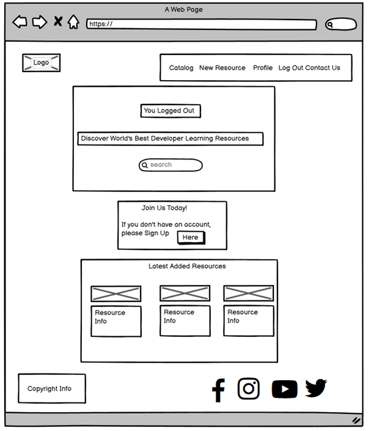

### Log Out Mobile Layout

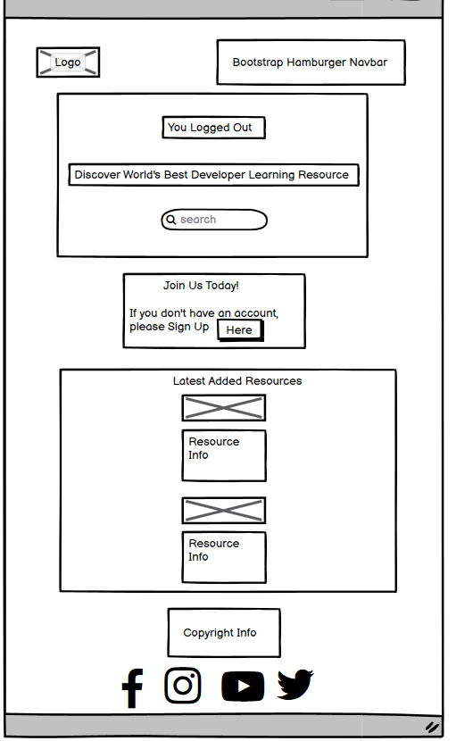

### Contact Page 
   
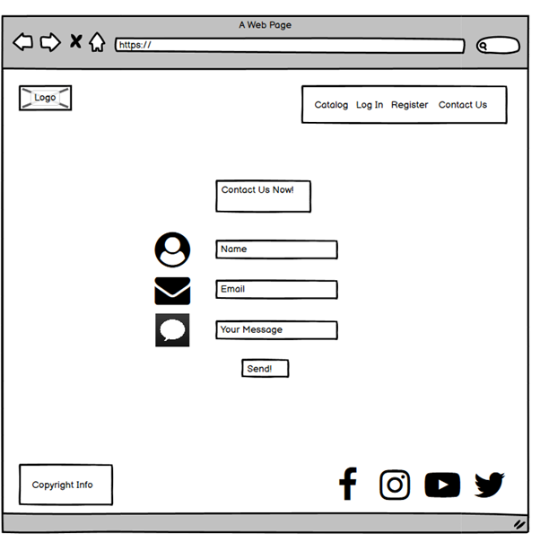

### Contact Page Mobile
   
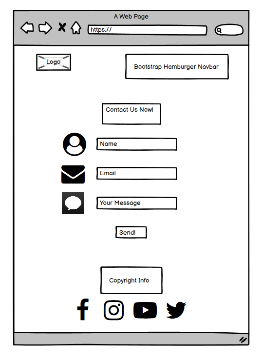

## Modifications from the Original Wireframes

## Website Structure

Sites

### Home

Home Page contains 3 sections:

Search bar where user can search for resources.
Call to Action for non registered Users -> Join Us Now! with the option to register.
Latest Resources -> Latest Added Resources Displayed.

### Home Page

### Resources

Library of Learning Resources. Used pagination of the bottom to organise them into pages.

### Log In

To allow users to log in . After succesfully log in, users get redirected to the profile page. A Register button for non-users can be found on this page.

### Log In Link 

### Register

Page where is possible to create an account. A Login link is  also displayed for visitors that already have an account.

### Register Link

### Ad Resource

Page used to add Learning Resources. All fields must be filled to complete the process. 
The form is validated and when submited succesfully the user gets redirected to their profile page.and redirects the user to the profile page. 
There is also a reset button to clear all info.

Ad Resource Link

### Profile

User can see their profile details on this page User's added resources can be displayed under show learning resources button. Information can be edited and deletedd.
Profile Link

### Log Out

Log Out option to close the session and go back to the home page.
Log Out Link

## Existing Features

• **** – 

• **** – 

• **** – 

• **** – 

• **** – 

• **** - 

• **** - 

• **** - 

• **** - 

## Database schema

The Database consists of  3 tables:

    resources
    resource_type
    users

The tables and their fields can be seen in the following image:

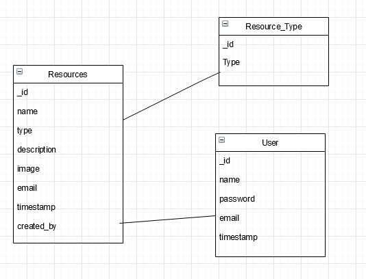

database schema:

## Features to Implement in the future

Option to join courses from the page.
Blog & Relevant News Section about Software Development

## Technologies Used
• HTML, CSS & JavaScript Programming Languages

• GitPod – Used as the Development IDE.

• Bootstrap4 layout to make the form responsive, used a CDN to include it in the project.

• FontAwesome: Great Icons Resource.

• Auto-Prefixer: Extension that adds all necessary extensions to the webite so that it works properly on all major browsers.

• Unsplash: Website that offers high quality free images.

• Realfavicongenerator: Used to create the Favicon.

• FreeLogoDesign: Tool used to design the logo.

• Balsamiq WireFrames: Outstanding Wireframe Software.

• EmailJS: To make the form work and receive visitors requests.

## Testing
The code was validated with the W3C Markup, W3C CSS and JSHint Validator Services to look for syntax errors.
The website passed all tests succesfully with no errors. An excel file with info about the tests performed was included in the repository.
### User Story Testing 

### High Level Test Classes

New Users would like to:

Discover New High Quality Learning Resources

Search Learning Resources catalog.

Able to access all Resources data.

Register easily and login immediately after registration.

Returning user want to:

Login and view details on their account.

Add a new assets to the database.

Edit learning ressources in the database.

Delete them.

Get a confirmation message on every action.

### Test Results

Complete Test Info can be found here ()

It is an .xlsx file and will a compatible program like excel or google docs to open the file.

## Links and images
All links function and all images are in the Gitpod repository.

## Bugs & Problems found during Testing
• 
•

### Further Testing

## Deployment
The website was developed using GitPod, committed to git and pushed to GitHub. It was then deployed with Github pages from its GitHub repository following these steps:

• Log in into GitHub.

• Select the repository and open settings.

• Scroll down to the GitHub Pages section and click Master Branch. With this, the website is deployed.

• Go to the GitHub pages section to get the website link.

## Cloning

• Type ‘cd’ in the terminal followed by the desired directory name where 
it will get cloned.

• Click on ‘Code’ (the green drop-down button on the top of the page).

• Copy the last link and type and type ‘git clone’ followed by the copied name.

## Content
• Social Media Icons are from Font Awesome.

• Bootstrap Navbar Documentation helped me to create the navigation menu.

## Media
• Pictures are from Unsplash.com and Google Images.

• The favicon was created using the resource 

## Code

## Acknowledgements
• I would like to thank my mentor Narender Singh, who was of great help in this project and was always really willing to help me and giving me useful feedback to get the most out of my project.

• I checked projects from other students to get an idea of the scope of the project and as inspiration for my project.

## Disclaimer
Fictional Companny Website created as my Milestone Project 3 of the Code Institute Full Stack Program.
